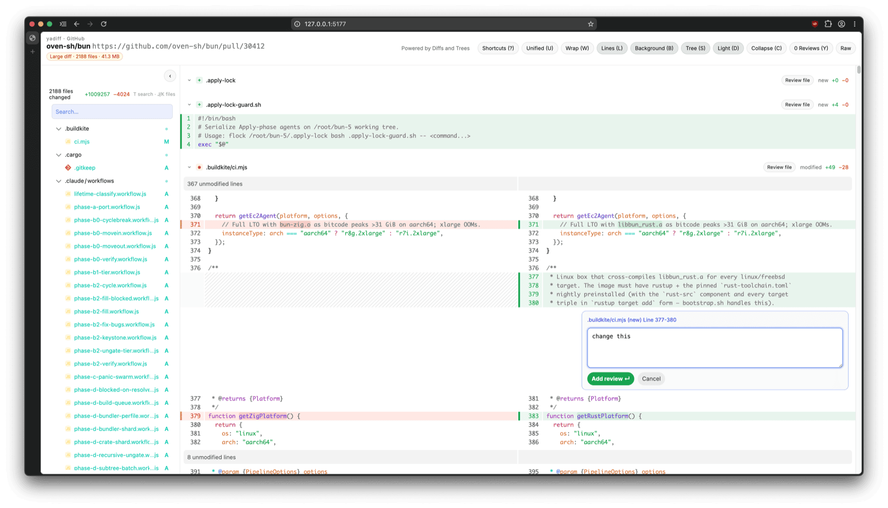

# yadiff, yet another diff viewer



> Huge shoutout to [pierrecomputer](https://github.com/pierrecomputer/pierre). Inspired by [diffshub](https://diffshub.com/), this tool is only possible thanks to the incredibly beautiful and high-performance diff and tree packages. All credit goes to the team!

A browser diff viewer for local git/jj diffs and GitHub PRs. It uses [pierrecomputer](https://github.com/pierrecomputer/pierre)'s open-source packages:

- [`@pierre/diffs`](https://github.com/pierrecomputer/pierre/tree/main/packages/diffs) for parsing/rendering diffs
- [`@pierre/trees`](https://github.com/pierrecomputer/pierre/tree/main/packages/trees) for the file tree

## Usage

Run directly with `npx`:

```bash
npx @baggiiiie/yadiff <git-ref-or-range>/<jj-revset>/<github-pr-url>
npx @baggiiiie/yadiff --working/--staged/--dirty
```

Or install globally:

```bash
npm install -g @baggiiiie/yadiff
yadiff HEAD
```

The command starts a local server in the background, opens the browser, acquires a diff from the selected source, and serves the patch to the browser. The shell command exits after launch. When there are no browser sessions for one minute, the local server exits automatically.

Use `--foreground` to keep the server attached to the current terminal.

### Examples:

Git:

```bash
npx @baggiiiie/yadiff HEAD
npx @baggiiiie/yadiff main..feature
npx @baggiiiie/yadiff main...HEAD --repo ../some-repo
npx @baggiiiie/yadiff --working/--staged/--dirty
```

jj:

```bash
npx @baggiiiie/yadiff @ --repo ../some-jj-repo
npx @baggiiiie/yadiff 'mine() & mutable()' --vcs jj
```

GitHub:

```bash
npx @baggiiiie/yadiff https://github.com/oven-sh/bun/pull/30412
```

Passing bun test:

https://github.com/user-attachments/assets/aeef9e88-5626-4799-9333-c4b9088282c8

## potential future improvement

- add a button to sync review to github, with `gh` cli?
- copy filename; open file with `$EDITOR`
- support for private repo and enterprise, with `gh` cli
- stdin support

## License

[MIT](./LICENSE).
